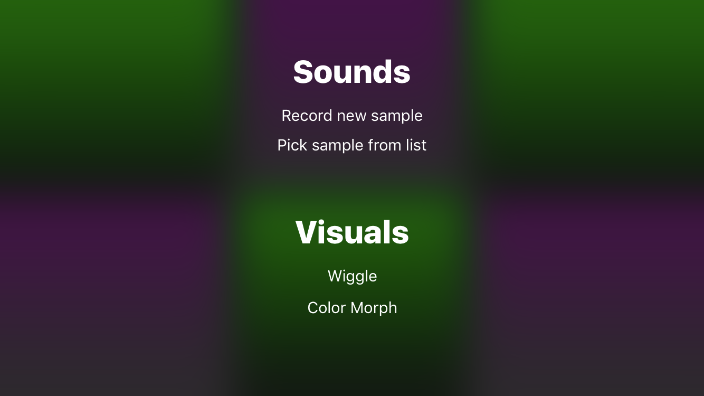
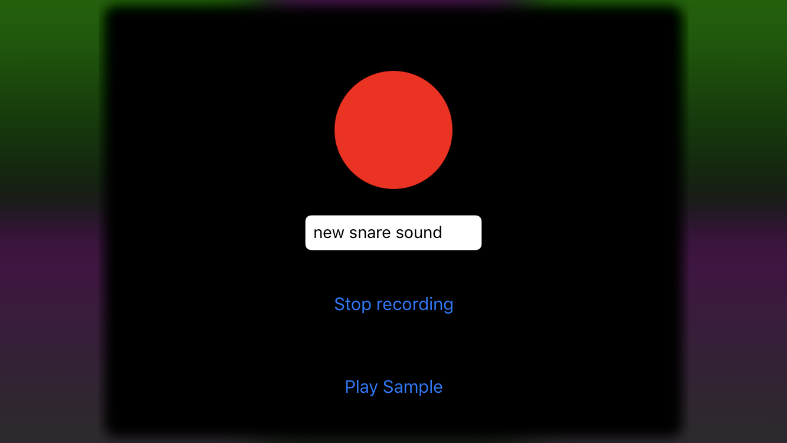
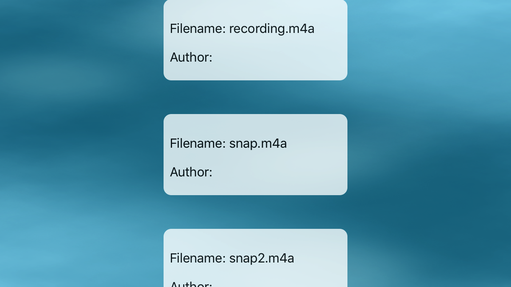

# iOS-Drum-Machine
A mobile drum machine for iOS devices

Tap on any pad for sample playback and corresponding animation.
 

Long press on any pad to pull up the options menu.  (Visual options coming soon)

Tapping on 'Record new sample' will pull up the recording menu.

Tapping on 'Pick sample from list' will pull up the sample selection screen and apply the chosen sample to the pad that was long pressed.  (Author information coming soon)

# Features
- Six drum pads for making a beat on the go
- Custom animations in response to drum pads being tapped
- Custom animation transitions from scene-to-scene for a unique feel
- Ability to record samples from device and assign them to drum pads

# Upcoming Features
- Ability to edit recorded samples to fine-tune before being played
- Ability to share recorded sound samples with other users who have the app
- Ability to customize the look, feel, and animation responses of drum pads
